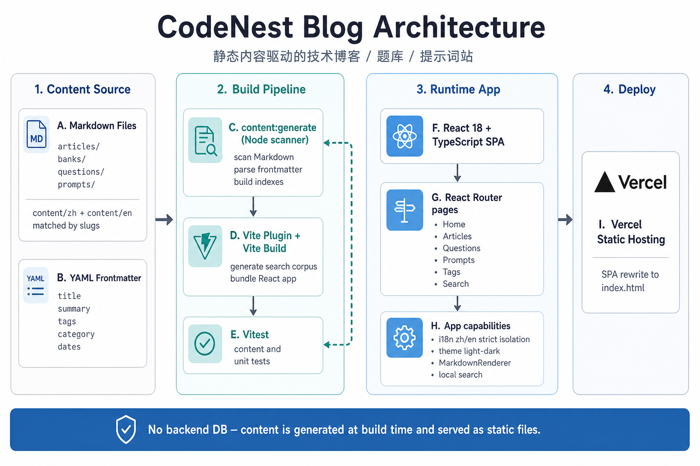

# CodeNest Blog

中文静态技术博客 / 题库 / 提示词站。内容以 Markdown 为源，构建时扫描生成索引，部署为纯静态站点。

> English version below ↓

---

## 中文

### 这个项目是做什么的

CodeNest Blog 是一个面向工程师的知识沉淀站点，主要承载三类内容：

1. **技术文章**：排查记录、学习笔记、工作复盘
2. **八股文题库**：按主题分类的高频问题与答案
3. **AI 提示词**：可直接复制使用的工程提示模板

站点支持 **中 / 英双语** 切换，语言严格隔离：切换语言后只展示当前语言内容，缺译不会回退到另一语言。

### 持续更新立场

本仓库会持续更新。

- 文章、题库、提示词会随学习与工作实践不断补充
- 优先保证内容可用、结构清晰，再逐步完善双语与排版细节
- 欢迎把真实踩坑、可复用经验写进 Markdown，丢进 `content/` 即可参与沉淀

### 技术栈

| 层级 | 技术 |
|------|------|
| UI | React 18 + TypeScript |
| 路由 | React Router v6 |
| 构建 | Vite 6 |
| 内容 | Markdown + YAML Frontmatter |
| 内容管道 | Node 扫描脚本 + Vite 插件（`content:generate`） |
| 测试 | Vitest + Testing Library |
| 部署 | Vercel（SPA rewrite） |

不依赖后端数据库；运行时读取构建期生成的内容索引与搜索语料。

### 功能概览

- 文章列表 / 详情 / 分类 / 标签 / 搜索
- 题库三级导航：分类 → 题目列表 → 题目详情
- 提示词库：分类浏览 + 代码块一键复制
- 中英切换、浅色 / 深色主题
- 轻量 Markdown 渲染（标题、列表、代码块、表格、链接、图片等）

### 内容目录

```text
content/
  zh/                          # 中文
    articles/*.md              # 文章
    banks/*.md                 # 题库分类
    questions/<bank>/*.md      # 题目
    prompts/*.md               # 提示词
  en/                          # 英文（与中文同 slug 配对）
    articles/
    banks/
    questions/
    prompts/
```

写作约定见：

- `content/README.md`
- `docs/ai-content-rules/RULES.zh.md`
- `docs/ai-content-rules/RULES.en.md`

### 本地开发

```bash
npm install
npm run dev
```

常用命令：

```bash
npm run content:generate   # 扫描 Markdown，生成索引与搜索语料
npm run build              # 生成内容 + 类型检查 + 生产构建
npm test                   # 生成内容后跑测试
```

### 架构图

将架构图放到仓库后，取消下面注释或替换为实际路径：

```markdown

```

（架构说明文案见本 PR / 对话回复，可交给绘图工具生成图片后放入 `docs/architecture.png`。）

---

## English

### What this project is

CodeNest Blog is a knowledge site for engineers. It currently hosts three content types:

1. **Articles** — troubleshooting notes, learning write-ups, and work retrospectives
2. **Question banks** — categorized interview-style Q&A
3. **AI prompts** — copy-ready engineering prompt templates

The site supports **Chinese / English** switching with strict language isolation: after switching, only the current language is shown. Missing translations do not fall back to the other language.

### Continuous updates

This repository is under active maintenance.

- Articles, question banks, and prompts will keep growing with real learning and work practice
- Prefer shipping useful, well-structured content first, then refine bilingual coverage and polish
- Drop Markdown into `content/` to contribute durable notes and reusable experience

### Tech stack

| Layer | Stack |
|------|------|
| UI | React 18 + TypeScript |
| Routing | React Router v6 |
| Build | Vite 6 |
| Content | Markdown + YAML Frontmatter |
| Content pipeline | Node scanner + Vite plugin (`content:generate`) |
| Testing | Vitest + Testing Library |
| Deploy | Vercel (SPA rewrite) |

No backend database is required. The runtime reads content indexes and search corpus generated at build time.

### Features

- Article list / detail / categories / tags / search
- Three-level question navigation: bank → list → detail
- Prompt library with category browsing and one-click code copy
- Language switch and light / dark theme
- Lightweight Markdown renderer (headings, lists, code blocks, tables, links, images, and more)

### Content layout

```text
content/
  zh/                          # Chinese
    articles/*.md
    banks/*.md
    questions/<bank>/*.md
    prompts/*.md
  en/                          # English (paired by the same slug)
    articles/
    banks/
    questions/
    prompts/
```

Writing guides:

- `content/README.md`
- `docs/ai-content-rules/RULES.zh.md`
- `docs/ai-content-rules/RULES.en.md`

### Local development

```bash
npm install
npm run dev
```

Common scripts:

```bash
npm run content:generate   # scan Markdown and generate indexes / search corpus
npm run build              # generate content + typecheck + production build
npm test                   # generate content, then run tests
```

### Architecture diagram

After you add the image to the repo, use:

```markdown

```

Suggested path: `docs/architecture.png`.
