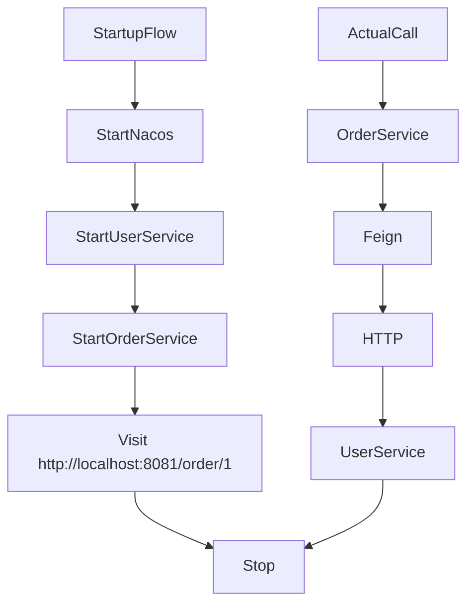

# Microservices Learning Diary 5

# Declarative REST Client

- Declarative REST Client vs. programmatic REST client (`RestTemplate`)

Annotation-driven:

- Specify the <span style="color:#e74c3c">remote address</span>: `@FeignClient`
- Specify the <span style="color:#e74c3c">request method</span>: `@GetMapping`, `@PostMapping`, `@DeleteMapping` ...
- Carry <span style="color:#e74c3c">request data</span>: `@RequestHeader`, `@RequestParam`, `@RequestBody` ...
- Specify the <span style="color:#e74c3c">response result</span>: response model

Pom dependency:

```pom
<dependency>
    <groupId>org.springframework.cloud</groupId>
    <artifactId>spring-cloud-starter-openfeign</artifactId>
</dependency>
```

# Using OpenFeign

1. Add the dependency

```pom
<dependency>
    <groupId>org.springframework.cloud</groupId>
    <artifactId>spring-cloud-starter-openfeign</artifactId>
</dependency>
```

2. Enable Feign

```java
@SpringBootApplication
@EnableFeignClients // Enable Feign remote calls
public class OrderApplication {
    public static void main(String[] args) {
        SpringApplication.run(OrderApplication.class, args);
    }
}
```

3. Define a Feign interface (core step)

```java
@FeignClient(name = "user-service") // name = "user-service": the service name in the registry (for example, Nacos)
public interface UserFeignClient { // Note: this must be an interface

    @GetMapping("/user/{id}") // Send the request with GET
    User getUserById(@PathVariable("id") Long id); // Bind the path parameter
}
```

This also shows two ways MVC annotations can be used:

1. On a controller, they mean "receive a request"
2. On a Feign client, they mean "send this kind of request"

4. Call Feign

```java
@RestController
@RequestMapping("/order")
public class OrderController {

    @Autowired
    private UserFeignClient userFeignClient; // Inject the Feign client

    @GetMapping("/{id}")
    public String createOrder(@PathVariable Long id) {
        User user = userFeignClient.getUserById(id); // Call it directly
        return "Order created successfully, user: " + user.getName();
    }
}
```

Extra: 4.1 Feign can also call third-party services

Suppose you want to call a third-party API:

`GET https://api.weather.com/v1/weather?city=beijing`

4.1.1 Feign call to a third-party API:

```java
@FeignClient(
        name = "weather-client", // Can be any name, because this is not a microservice
        url = "https://api.weather.com" // Key point: specify the third-party base URL directly
)
public interface WeatherFeignClient {

    @GetMapping("/v1/weather")
    String getWeather(@RequestParam("city") String city);
}
```

- `url`: points to the third-party address directly (does not go through the registry)
- `name`: can be any name, used to distinguish the Bean
- This approach means Feign calls the external service directly

4.1.2 Call the API

```java
@RestController
@RequestMapping("/test")
public class TestController {

    @Autowired
    private WeatherFeignClient weatherFeignClient; // Inject Feign

    @GetMapping("/weather")
    public String test() {
        return weatherFeignClient.getWeather("beijing"); // Call it directly
    }
}
```

5. Configuration

```yaml
spring:
  application:
    name: order-service // Current service name

  cloud:
    nacos:
      server-addr: localhost:8848 // Address of the registry/service endpoint

feign:
  client:
    config:
      default:
        loggerLevel: FULL
```

6. Startup flow


