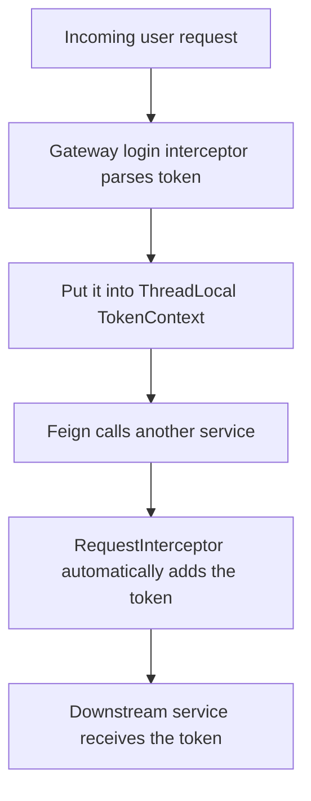

# Microservices Learning Diary 6

# Advanced OpenFeign Usage

## 1. Timeout Control

There are two basic kinds:

1. `connectTimeout`
   How long to wait at most when establishing the TCP connection

2. `readTimeout`
   Once the connection is established, how long to wait at most for the other side to return data

### Example

1. Feign interface

```java
@FeignClient(name = "user-service", configuration = FeignConfig.class)
public interface UserFeignClient {

    @GetMapping("/user/{id}")
    String getUserById(@PathVariable("id") Long id);
}
```

2. Config class (core)

```java
@Configuration
public class FeignConfig {

    @Bean
    public Request.Options options() {
        return new Request.Options(
                3 * 1000,   // Connection timeout: 3 seconds. If the service cannot be reached in 3 seconds, fail immediately.
                5 * 1000    // Read timeout: 5 seconds. If the connection succeeds but no response arrives within 5 seconds, throw a timeout.
        );
    }
}
```

### Configuration-file approach

```yaml
feign:
  client:
    config:
      default: # Global default config
        connectTimeout: 3000   # 3 seconds
        readTimeout: 5000      # 5 seconds

      user-service: # Override timeout settings for one specific service
        connectTimeout: 2000
        readTimeout: 3000
```

## 2. Retry Mechanism

Purpose: if a request fails, try a few more times instead of failing immediately.

Suitable for:

- Network jitter
- Brief service unavailability
- Momentary timeouts

### The simplest usable retry mechanism

1. Config-class approach

```java
@Configuration
public class FeignRetryConfig {

    @Bean
    public Retryer retryer() {
        return new Retryer.Default(
                100,    // Initial interval: 100ms
                1000,   // Maximum interval: 1 second
                3       // Maximum retries (total requests = 1 + 3 = 4)
        );
    }
}
```

2. Bind it to Feign

```java
@FeignClient(
    name = "user-service",
    configuration = FeignRetryConfig.class
)
public interface UserFeignClient {

    @GetMapping("/user/{id}")
    String getUserById(@PathVariable("id") Long id);
}
```

3. Configuration-file approach (recommended)

```yaml
feign:
  client:
    config:
      default:
        connectTimeout: 3000
        readTimeout: 5000
        retryer: feign.Retryer.Default # Default retry mechanism; you can inspect the default retry timings
```

4. Important parameters

```java
new Retryer.Default(100, 1000, 3)
```

| Parameter | Meaning |
| --- | --- |
| `period` | Initial retry interval |
| `maxPeriod` | Maximum interval |
| `maxAttempts` | Maximum number of attempts |

```java
Attempt 1: fail
wait 100ms

Attempt 2: fail
wait 200ms (exponential growth)

Attempt 3: fail
wait 400ms

Attempt 4: fail -> throw exception
```

This is called **exponential backoff**.

5. Important notes

1. By default, Feign does **not** retry.
2. Not every request should be retried.
   Idempotency matters:
   - Safe to retry: GET queries and lookup endpoints
   - Usually not recommended: place order, deduct inventory, payment

## 3. Interceptors

### 3.1 Request interceptor

1. Write an interceptor

```java
@Component
public class FeignTokenInterceptor implements RequestInterceptor {

    @Override
    public void apply(RequestTemplate template) {

        // Simulate retrieving a token from context (in a real project this usually comes from ThreadLocal / SecurityContext)
        String token = TokenContext.getToken();

        if (token != null && !token.isEmpty()) {
            template.header("Authorization", "Bearer " + token);
        }
    }
}
```

2. `TokenContext` (a simple simulation of a real-world scenario)

```java
public class TokenContext {

    private static final ThreadLocal<String> TOKEN_HOLDER = new ThreadLocal<>();

    public static void setToken(String token) {
        TOKEN_HOLDER.set(token);
    }

    public static String getToken() {
        return TOKEN_HOLDER.get();
    }

    public static void clear() {
        TOKEN_HOLDER.remove();  // Clear the context
    }
}
```

3. Full call chain



### 3.2 Response interceptor

Purpose: handle responses after they return, for logging, token refresh, and similar concerns.

1. Custom `Client`

```java
@Component
public class FeignResponseInterceptor implements Client {

    private final Client delegate;

    public FeignResponseInterceptor(Client delegate) {
        this.delegate = delegate;
    }

    @Override
    public Response execute(Request request, Request.Options options) throws IOException {
        long start = System.currentTimeMillis();
        Response response = delegate.execute(request, options);
        long end = System.currentTimeMillis();

        // Print request duration and status code
        System.out.println("Feign request URL: " + request.url());
        System.out.println("Status code: " + response.status());
        System.out.println("Elapsed: " + (end - start) + "ms");

        return response;
    }
}
```

2. Configure Feign to use this interceptor

```java
@Configuration
public class FeignConfig {

    @Bean
    public Client feignClient(Client client) {
        return new FeignResponseInterceptor(client);
    }
}
```

```java
@FeignClient(name = "user-service", configuration = FeignConfig.class)
public interface UserFeignClient {

    @GetMapping("/user/{id}")
    String getUserById(@PathVariable("id") Long id);
}
```

## 4. Fallback

Note: <span style="color:#e74c3c">this feature requires Sentinel integration</span>

Purpose: when a Feign call fails (timeout / exception / circuit breaker), return a fallback result instead of throwing an error directly.


### 4.1 Implementation steps

1. Add the dependency

```pom
<dependency>
    <groupId>com.alibaba.cloud</groupId>
    <artifactId>spring-cloud-starter-alibaba-sentinel</artifactId>
</dependency>
```

2. Enable Sentinel support for Feign

```yaml
feign:
  sentinel:
    enabled: true
```

3. Write the circuit-breaker/fallback handler class

```java
@Component
public class UserFeignFallback implements UserFeignClient {

    @Override
    public String getUserById(Long id) {
        return "User service is unavailable, returning default user info";
    }
}
```

4. Feign interface

```java
@FeignClient(
    name = "user-service",
    fallback = UserFeignFallback.class // Use it here
)
public interface UserFeignClient {

    @GetMapping("/user/{id}")
    String getUserById(@PathVariable("id") Long id);
}
```

5. Runtime behavior

Assume:

- `user-service` is down
- or the call times out

Normal case:

```text
Call user-service -> return user data
```

Error case:

```text
Call fails -> automatically enter fallback -> return default data
```

6. Sentinel's main roles

- Circuit breaking (service too slow / high exception rate)
- Rate limiting (QPS too high)
- Degradation (trigger fallback)

Feign itself is just the **call tool**.

7. Important pitfalls

1. The fallback class must have `@Component`, otherwise fallback will not take effect.
2. Fallback logic should not be too complex. Rule of thumb: degradation logic must stay light. Do **not** query the database, and do **not** call other services, or you risk a **cascade failure**.
3. Fallback is not a universal answer. For core business flows such as payment or order placement, you cannot degrade casually.
