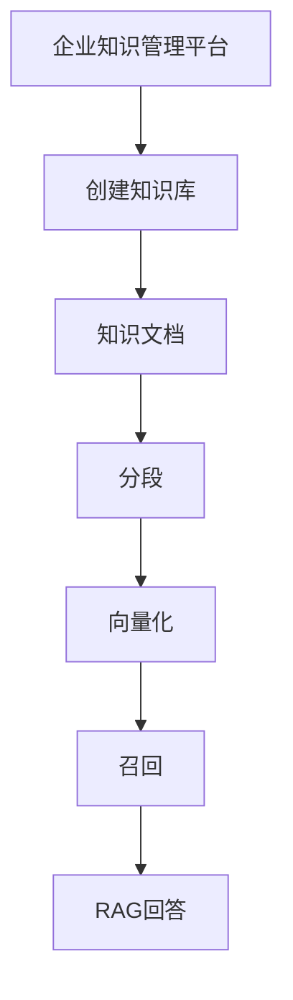

# 工作日记-1

## 今天学到了什么业务知识 ？

```mermaid
graph TD
企业知识管理平台 --> 创建知识库 --> 知识文档 --> 分段 --> 向量化 --> 召回 --> RAG回答 
```
**思考**： 为什么这个知识库管理页面会存在，解决什么样的需求？ 【10天】

- 浅浅回答： 是为了存放海量公司数据，帮助企业员工快速检索检索知识，解决客户需求以及提升工作效率。

**思考**： 最终能产生什么价值 ？【30天】

- 浅浅回答： 全员 AI ，提升工作效率 。
