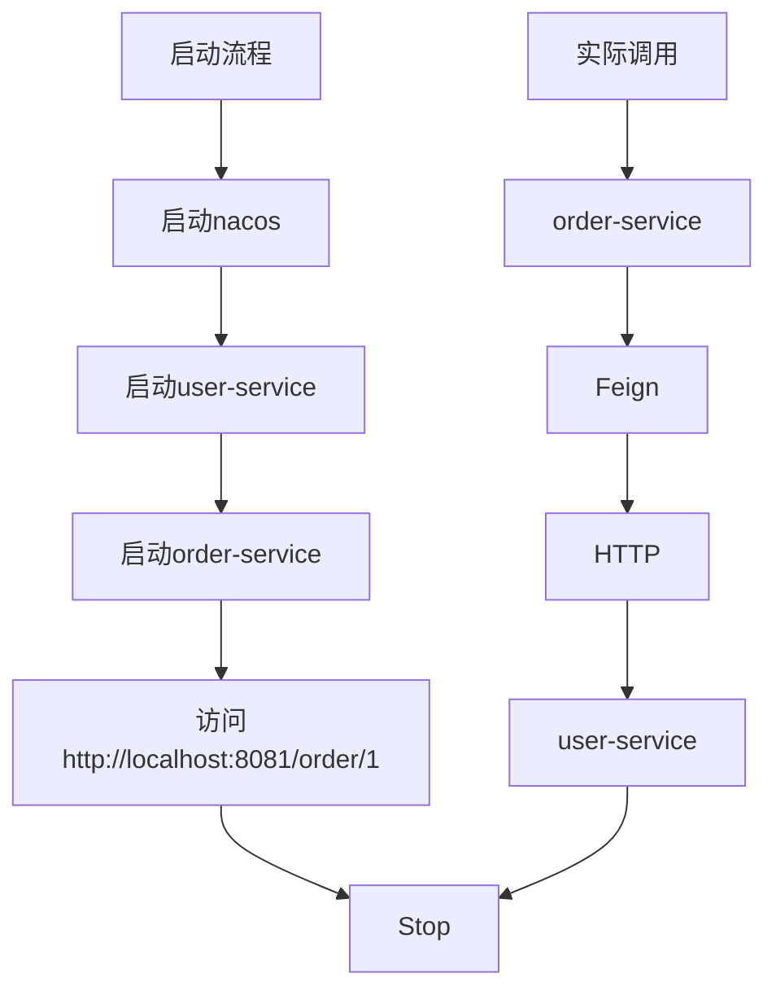

# 微服务学习日记 5

# Declarative REST Client 声明式客户端

- 声明式 REST 客户端 VS 编程式 REST 客户端 (RestTemplate) 

注解驱动：

- 指定<span style="color:#e74c3c">远程地址</span>：@FeignClient
- 指定<span style="color:#e74c3c">请求方式</span>：@GetMapping ，@PostMapping ， @DeleteMapping ...
- 携带<span style="color:#e74c3c">请求数据</span>:  @RequestHeader , @RequestParam , @RequestBody ... 
- 指定<span style="color:#e74c3c">结果返回</span>:  响应模型

Pom依赖:

```pom
<dependency>
    <groupId>org.springframework.cloud</groupId>
    <artifactId>spring-cloud-starter-openfeign</artifactId>
</dependency>
```

# 使用 openFeign

1. 引入依赖

```pom
<dependency>
    <groupId>org.springframework.cloud</groupId>
    <artifactId>spring-cloud-starter-openfeign</artifactId>
</dependency>
```

2. 开启 Feign

```java
@SpringBootApplication
@EnableFeignClients // 开启 Feign 远程调用功能
public class OrderApplication {
    public static void main(String[] args) {
        SpringApplication.run(OrderApplication.class, args);
    }
}
```

3. 定义 Feign 接口（核心！！！）

```java
@FeignClient(name = "user-service") // name = "user-service"：对应注册中心里的服务名（比如 Nacos）
public interface UserFeignClient { // 注意是接口

    @GetMapping("/user/{id}") // 使用 Get 发送请求
    User getUserById(@PathVariable("id") Long id); // 绑定路径参数
}
```

由此延伸出MVC 注解的两套使用方法：
1 ) 标注在 controller 上代表接受请求
2 ） 标注在 Feign 客户端上代表发送某种请求 。

4. 调用 Feign

```java
@RestController
@RequestMapping("/order")
public class OrderController {

    @Autowired
    private UserFeignClient userFeignClient; // 注入 Feign 客户端

    @GetMapping("/{id}")
    public String createOrder(@PathVariable Long id) {
        User user = userFeignClient.getUserById(id); // 直接调用 
        return "创建订单成功，用户：" + user.getName();
    }
}
```

【补充】4.1 Feign  也可以给第三方服务发送请求

假设你要调用一个第三方接口：

`GET https://api.weather.com/v1/weather?city=beijing`

4.1.1 ） Feign 调用第三方接口：

```java
@FeignClient(
        name = "weather-client", // 随便写，因为不是微服务
        url = "https://api.weather.com" // 关键：直接写第三方地址
)
public interface WeatherFeignClient {

    @GetMapping("/v1/weather")
    String getWeather(@RequestParam("city") String city);
}
```
- url：指定第三方地址（不走注册中心！）
- name：随便写，用于区分 Bean
- 这种方式 = Feign 直连外部服务

4.1.2 ） 调用接口

```java
@RestController
@RequestMapping("/test")
public class TestController {

    @Autowired
    private WeatherFeignClient weatherFeignClient; // 注入 Feign

    @GetMapping("/weather")
    public String test() {
        return weatherFeignClient.getWeather("beijing"); // 直接调用即可
    }
}
```

5. 配置

```yaml
spring:
  application:
    name: order-service // 当前服务名字

  cloud:
    nacos:
      server-addr: localhost:8848 //远程调用服务地址

feign:
  client:
    config:
      default:
        loggerLevel: FULL 
```

6. 启动流程


