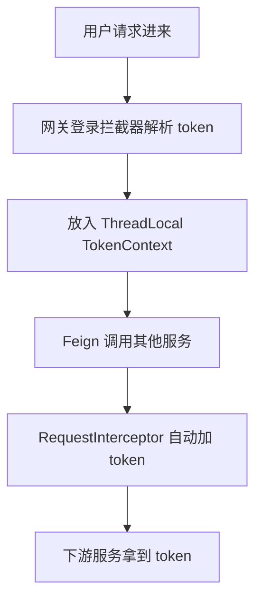

# 微服务学习日记 6

# OpenFeign 进阶使用
 
 
 ##  1. 超时控制
 
简单说就两种：
1. 连接超时（connectTimeout）
  建立 TCP 连接最多等多久
  
2. 读取超时（readTimeout）
   已经连上了，等对方返回数据最多等多久
   
   
### 示例：

1️⃣ Feign 接口
```java
@FeignClient(name = "user-service", configuration = FeignConfig.class)
public interface UserFeignClient {

    @GetMapping("/user/{id}")
    String getUserById(@PathVariable("id") Long id);
}
```

2️⃣ 配置类（核心）

```java
@Configuration
public class FeignConfig {

    @Bean
    public Request.Options options() {
        return new Request.Options(
                3 * 1000,   // 连接超时 3秒 如果 3秒连不上服务 → 直接报错
                5 * 1000    // 读取超时 5秒 如果 连上了但5秒没响应 → 报超时
        );
    }
}
```

### 配置文件方式

```yaml
feign:
  client:
    config:
      default: # 全局默认配置
        connectTimeout: 3000   # 3秒
        readTimeout: 5000      # 5秒

      user-service: #单独给某个服务区指定超时时间
        connectTimeout: 2000   # 单独给某个服务更严格
        readTimeout: 3000
```

 ## 2. 重试机制
 
 目的： 请求失败后，再试几次，而不是直接挂掉
 
 适用于：
- 网络抖动
- 服务短暂不可用
- 瞬时超时

### 最简单可用的重试机制

1️⃣ 配置类方式

```java
@Configuration
public class FeignRetryConfig {

    @Bean
    public Retryer retryer() {
        return new Retryer.Default(
                100,    // 初始间隔 100ms
                1000,   // 最大间隔 1秒
                3       // 最大重试次数（总共请求 = 1 + 3 = 4次）
        );
    }
}
```

2️⃣ 绑定到 Feign

```java
@FeignClient(
    name = "user-service",
    configuration = FeignRetryConfig.class
)
public interface UserFeignClient {

    @GetMapping("/user/{id}")
    String getUserById(@PathVariable("id") Long id);
}
```

3️⃣ 配置文件方式（更推荐）

```yaml
feign:
  client:
    config:
      default:
        connectTimeout: 3000
        readTimeout: 5000
        retryer: feign.Retryer.Default # 默认重试机制 可以点进去看看默认重试时间
```

4️⃣ 重点参数

```java
new Retryer.Default(100, 1000, 3)
```

| 参数 | 含义  |
| --- | --- |
| period | 初始重试间隔 |
| maxPeriod | 最大间隔 |
| maxAttempts | 最大尝试次数 |

```java
第1次：失败
等100ms

第2次：失败
等200ms（指数增长）

第3次：失败
等400ms

第4次：失败 → 抛异常
```
这个叫：**指数退避（Exponential Backoff）**

5️⃣ 注意：

1. 默认情况下 Feign 是不重试的！
2. 不是所有请求都能重试！！！ 
 幂等性问题（重点） ：
- 可以重试：GET 查询 ， 查询接口
- 不建议重试： 下单 ，扣库存 ， 支付

## 3. 拦截器 

### 3.1 请求拦截器

1️⃣ 写一个拦截器 ：
```java
@Component
public class FeignTokenInterceptor implements RequestInterceptor {

    @Override
    public void apply(RequestTemplate template) {

        // 模拟从上下文中获取 token（实际项目一般从 ThreadLocal / SecurityContext 获取）
        String token = TokenContext.getToken();

        if (token != null && !token.isEmpty()) {
            template.header("Authorization", "Bearer " + token);
        }
    }
}
```

2️⃣ TokenContext（模拟一下真实场景）：

```java
public class TokenContext {

    private static final ThreadLocal<String> TOKEN_HOLDER = new ThreadLocal<>();

    public static void setToken(String token) {
        TOKEN_HOLDER.set(token);
    }

    public static String getToken() {
        return TOKEN_HOLDER.get(); 
    }

    public static void clear() {
        TOKEN_HOLDER.remove();  // 清除上下文
    }
}
```

3️⃣ 完整调用链：



### 3.2 响应拦截器 

作用：在返回后处理响应、日志、token刷新 。 

1️⃣ 自定义 Client

```java
@Component
public class FeignResponseInterceptor implements Client {

    private final Client delegate;

    public FeignResponseInterceptor(Client delegate) {
        this.delegate = delegate;
    }

    @Override
    public Response execute(Request request, Request.Options options) throws IOException {
        long start = System.currentTimeMillis();
        Response response = delegate.execute(request, options);
        long end = System.currentTimeMillis();

        // 打印请求耗时和状态码
        System.out.println("Feign 请求 URL: " + request.url());
        System.out.println("状态码: " + response.status());
        System.out.println("耗时: " + (end - start) + "ms");

        return response;
    }
}
```
2️⃣ 配置 Feign 使用这个拦截器

```java
@Configuration
public class FeignConfig {

    @Bean
    public Client feignClient(Client client) {
        return new FeignResponseInterceptor(client);
    }
}
```

```java
@FeignClient(name = "user-service", configuration = FeignConfig.class)
public interface UserFeignClient {

    @GetMapping("/user/{id}")
    String getUserById(@PathVariable("id") Long id);
}
```

## 4. Fallback （兜底返回）

注意：<span style="color:#e74c3c">此功能需要整合 Sentinel 实现</span>

 作用：  当 Feign 调用失败时（超时 / 异常 / 熔断）不要报错，而是返回一个“兜底结果”
 


### 4.1 实现步骤

1️⃣ 引入依赖

```pom
<dependency>
    <groupId>com.alibaba.cloud</groupId>
    <artifactId>spring-cloud-starter-alibaba-sentinel</artifactId>
</dependency>
```

2️⃣ 开启 Feign 对 Sentinel 的支持

```yaml
feign:
  sentinel:
    enabled: true
```

3️⃣ 编写熔断/回调处理类

```java
@Component
public class UserFeignFallback implements UserFeignClient {

    @Override
    public String getUserById(Long id) {
        return "用户服务异常，返回默认用户信息";
    }
}
```
4️⃣ Feign 接口

```java
@FeignClient(
    name = "user-service",
    fallback = UserFeignFallback.class // 💡 在这使用
)
public interface UserFeignClient {

    @GetMapping("/user/{id}")
    String getUserById(@PathVariable("id") Long id);
}
```

5️⃣ 运行效果

假设：
- user-service 挂了
- 或者超时

正常情况：

```text
调用 user-service → 返回用户数据
```

异常情况：

```text
调用失败 → 自动进入 fallback → 返回默认数据
```

6️⃣ Sentinel 主要用途

- 熔断（服务太慢 / 异常率高）
- 限流（QPS太高）
- 降级（触发 fallback）

Feign 只是“调用工具”

7️⃣ 必须知道的坑 

1. fallback 类必须加 @Component ， 不然直接 404 fallback 不生效 。
2. fallback 不能写太复杂 ， 原则： 降级逻辑必须“轻” ， ❌ 查数据库 ， ❌ 调别的服务 ，否则会<span style="color:#e74c3c">雪崩</span>
3. fallback ≠ 万能，如果核心业务：支付，下单 。不能随便降级！！！
